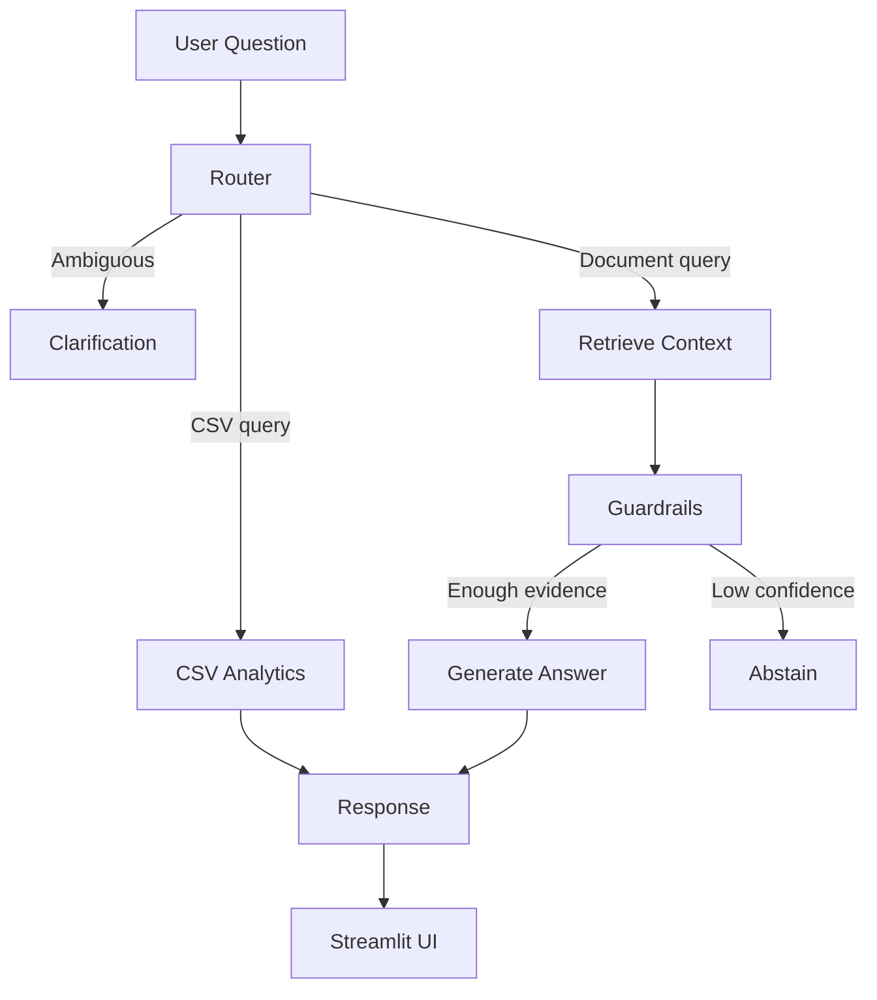

# Lightweight RAG Business Assistant

This project was built as part of a take-home assignment to explore retrieval-augmented generation (RAG) on a small business knowledge base.

The goal was not to build a production-ready system, but to demonstrate document retrieval, grounded question answering, structured-data handling, guardrails, and evaluation within a limited development window.

**Demo video:** '../output/demo_rag_assistant.webm'

---

## Features

| Part | Implementation |
|------|----------------|
| **RAG core** | Chunked document index, HF cloud embeddings, Chroma retrieval, cited answers |
| **Uncertainty** | Confidence levels from retrieval scores; partial/abstain responses |
| **Clarification** | Lightweight ambiguity pre-check for vague questions |
| **Structured data** | Pandas-based CSV analytics for sales/aging queries |
| **Guardrails** | Retrieval threshold abstain, citation enforcement, prompt injection block |
| **Evaluation** | Automated test suite with retrieval, citation, abstain, and CSV checks |

---

## Setup

### Prerequisites

- Python 3.10+
- [Hugging Face account](https://huggingface.co/join) with an API token ([settings/tokens](https://huggingface.co/settings/tokens))
- Accept model licenses on HF for `HuggingFaceH4/zephyr-7b-beta` and `meta-llama/Llama-3.1-8B-Instruct` if prompted

### Install

```bash
cd icloudfiles
python3 -m venv .venv
source .venv/bin/activate   # Windows: .venv\Scripts\activate
pip install -r requirements.txt
cp .env.example .env
# Edit .env and set HF_TOKEN=hf_...
```

### Index documents

```bash
python3 scripts/ingest.py
```

This embeds sample documents via **Hugging Face Inference API** (cloud-hosted — no local GPU required) and stores vectors in `.chroma_db/`.

### Run the app

```bash
streamlit run app.py
```

### Run evaluation

```bash
python3 -m src.eval.run_eval
```

---

## Architecture



### Components

| Module | Role |
|--------|------|
| `scripts/` | Offline ingest: load, chunk, embed into Chroma |
| `src/retrieval/` | HF Inference embeddings + Chroma cosine search |
| `src/generation/` | HF chat completion with grounded system prompt |
| `src/structured/` | Template-based pandas queries on `inventory_aging.csv` |
| `src/guardrails/` | Threshold abstain, citations, injection detection, PII masking |
| `src/pipeline.py` | End-to-end RAG orchestration |
| `src/router.py` | Query routing (document / structured / clarify) |
| `src/eval/` | Automated evaluation suite |

---

## Sample documents

| File | Type |
|------|------|
| `data/documents/shipping_escalation_sop.md` | SOP — delayed shipment escalation |
| `data/documents/procurement_policy.md` | Policy — procurement approval workflow |
| `data/documents/inventory_kpi_guide.md` | KPI definitions — inventory aging |
| `data/documents/q4_ops_email.txt` | Email — Q4 ops review |
| `data/structured/inventory_aging.csv` | CSV — branch/SKU sales and aging |

### Example questions

- "What is the escalation process for delayed shipments?"
- "What is the approval workflow for procurement requests?"
- "Explain the inventory aging KPI."
- "Which branch has the highest sales?"
- "What is the average inventory aging?"
- "Show top 5 SKUs by aging days."

---

## Design choices

Since this was scoped as a 3–4 hour assignment, I prioritized simplicity and reliability over building a production-ready system.

A few decisions I made:

- Used Hugging Face Inference API instead of running models locally. This kept setup lightweight and avoided GPU requirements.
- Used ChromaDB because it was quick to integrate and works well for a small document corpus.
- For the CSV portion, I chose pandas-based intent templates rather than natural-language-to-SQL generation. It is less flexible but much more deterministic for the assignment scenarios.
- Focused on retrieval quality and grounding rather than adding more model complexity.


### Assumptions

- English-only queries and documents
- Small fixed corpus (5 files); no user upload in v1
- Single-user demo; no real access control
- HF token has Inference API access for chosen models

---

## Guardrails

### 1. Minimum retrieval threshold (abstain)

- **Why:** Prevents answering when no relevant evidence exists in the corpus.
- **Risk mitigated:** Hallucination on out-of-domain questions (e.g., "CEO's salary").
- **Limitation:** Fixed similarity thresholds may abstain on valid paraphrases or accept weak matches near the cutoff.

### 2. Citation-only factual claims

- **Why:** Every document-grounded answer must trace back to a source chunk.
- **Risk mitigated:** Ungrounded assertions; improves auditability.
- **Limitation:** Checks that citations exist, not that they semantically support each claim.

### 3. Prompt injection detection

- **Why:** Users may embed instructions like "ignore previous instructions."
- **Risk mitigated:** System prompt override / basic jailbreak attempts in user input.
- **Limitation:** Pattern-based only; novel or obfuscated attacks are not caught.

### Bonus: PII masking

- Email and phone patterns in retrieved snippets are redacted before display.
- Does not remove PII from source files themselves.

---

## Uncertainty handling 

Confidence is derived from the **maximum retrieval similarity score**:

| Score | Confidence | Behavior |
|-------|------------|----------|
| ≥ 0.65 | High | Full answer with citations |
| 0.45–0.64 | Medium | Answer + uncertainty disclaimer |
| 0.30–0.44 | Low | Partial answer; states limitations |
| < 0.30 | Abstain | Refuses to answer |

**Ambiguity pre-check:** Vague questions (e.g., "Why is the report bad?") trigger a clarifying question before retrieval.

---

## Evaluation approach 

The evaluation suite evolved during development and ended up being one of the most useful parts of the project.

The initial version passed 8/14 evaluation cases. Most failures were caused by retrieval granularity, weak abstention logic, and generation issues on workflow-style questions.

After improving chunking, retrieval filtering, prompt design, output validation, and abstention behavior, the final version passed all 14 evaluation cases.

The test suite covers:

1. Retrieval relevance
2. Retrieval ranking
3. Citation coverage
4. Groundedness checks
5. Abstain correctness
6. Structured-data accuracy
7. Clarification behavior
8. Prompt-injection blocking

### Final results

Final evaluation result: **14/14 test cases passed**.

The passing cases cover retrieval quality, citation coverage, groundedness, abstention behavior, clarification handling, prompt-injection blocking, and structured-data queries.


---

## Limitations

- HF serverless inference can be slow or rate-limited on the free tier
- No reranker — retrieval quality depends on embedding similarity alone
- CSV routing uses keyword templates, not natural-language-to-SQL
- Clarification is single-turn heuristic, not multi-turn dialog
- English-only; small fixed corpus

---

## Known challenges during development

A recurring issue was generation quality when using smaller hosted models. In some cases the model would echo prompts, repeat workflow steps, or copy retrieved context directly into the answer.

Most of these issues were mitigated through prompt refinement, output sanitization, and switching to a stronger instruction-tuned model, though they highlighted the importance of retrieval and post-processing in small RAG systems.

---


## If I had more time (FUTURE IMPROVEMENTS)

If I were continuing this project, the first thing I would add is conversational memory so follow-up questions can reuse previously retrieved context.

A few things I would explore next:

- Add conversation history so follow-up questions can use previous context.
- Experiment with hybrid retrieval (keyword + vector search).
- Add a reranking step before sending chunks to the LLM.
- Support document uploads instead of relying on a fixed sample corpus.
- Improve the clarification flow to support multi-turn conversations.

---

## Notes from development

One thing I learned while building this is that retrieval quality mattered more than the model itself.

I initially assumed most accuracy issues would come from the LLM, but many of the biggest improvements actually came from chunking, retrieval filtering, and evaluation-driven debugging.

The first version indexed documents almost at the file level, which caused relevant sections to be buried inside large chunks. After moving to section-aware chunking and adding contextual metadata during embedding, retrieval quality improved significantly.

I also ran into a few generation issues with smaller HF models, including prompt echoing and repetitive outputs. Adding output sanitization and refining the prompts helped reduce these failure modes.

## Project structure

```
(root)/
├── app.py                  # Streamlit UI
├── requirements.txt
├── .env.example
├── data/
│   ├── documents/          # Sample policies, SOPs, emails
│   └── structured/         # inventory_aging.csv
├── scripts/                # Offline index build
│   ├── ingest.py           # CLI entrypoint
│   ├── loaders.py          # Load .md, .txt, .pdf
│   └── chunker.py          # Section-aware chunking
└── src/
    ├── config.py           # Paths, models, thresholds
    ├── pipeline.py         # RAG orchestration
    ├── router.py           # Query routing
    ├── retrieval/          # Embedder, vector store, post-filter
    ├── generation/         # LLM client, prompts
    ├── structured/         # CSV analytics
    ├── guardrails/         # Abstain, citations, injection, PII
    └── eval/               # Test cases + run_eval.py
```
